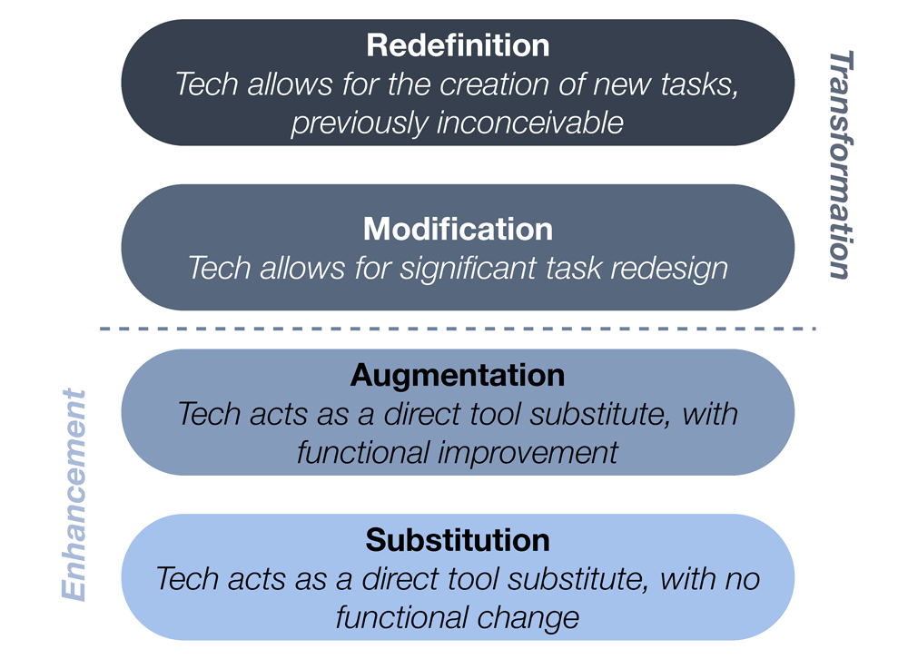

Ich mag es, wenn es etwas zu entdecken gibt, weil ich es noch nicht kenne. Von Digitalisierung haben wir aber schon so viel gehört, dass das Wort alleine wohl niemanden mehr vom Hocker reisst. Was nun dafür allen klar ist: Durch das Digital-Ding hat sich schon so einiges verändert und die Veränderung wird sich fortsetzen. Wohin genau die Reise geht, werden wir sehen, wenn wir dort sind. Aber darüber spekulieren, macht trotzdem Spass.

Die kaufmännische Bildung ist besonders gefordert, sich neu zu finden in der digitalen Transformation. Es ist die grösste Berufsbildung der Schweiz und so wird unter dem Begriff ["Kaufleute 2022"](https://www.skkab.ch/de/kaufleute-2022) daran getüftelt, was es braucht, um diese Ausbildung fit zu machen für die Zukunft.

Zukünftig stärker geforderte **Kompetenzen** sind mitunter:

- Informations- und Datenanalyse
- Kommunikation und Kollaboration
- Kritisches Denken
- Kreatives Handeln
- Digitale Inhalte kreieren
- Datensicherheit
- Problemlösestrategien
- Prozessuales Denken
- Projekte führen/begleiten
- Veränderungsbereitschaft / Selbstwirksamkeit

## Geht es etwas transformierter?

Irgendwie scheint es unpassend, von radikalen Umwälzungen zu sprechen, während wir uns Bildung in Zeiten der Digitalisierung höchstens vorstellen mit weniger Lehrbüchern und mehr Online-Material. Das tönt verdächtig nach dem papierlosen Büro, von dem wir vor 20 Jahren geträumt haben, um dann ein paar Jahre später zu merken, dass nur noch mehr Papier ver(sch)wendet wird.

Wenn es solche Phänomene gibt, gibt es meist jemanden, der das in ein schönes Modell packt. In diesem Fall ist es Dr. Ruben Puentedura, der mit dem [SAMR Modell](http://hippasus.com/rrpweblog/archives/2015/10/SAMR_ABriefIntro.pdf) verschiedene Stufen aufzeigt, wie neue Technologien unsere Lernprozesse verändern können.

Es ist ganz schwierig, aus unserer "Box" zu kriechen. Aber versuchen sollten wir es zumindest.

In [Persönlicher Lernblog - eine Idee und Vision](/persoenlicher-lernblog/) habe ich versucht zu skizzieren, wie wir die Welle der digitalen Transformation reiten können, um zu neuen Formen des Lernens zu gelangen.  

Mit dem [Projekt BYOD und der AG bwd digital](/projektstart-bring-your-own-device/) haben wir am bwd Bern zwei Gruppen initiiert, welche sich aufmachen, zu entdecken, was möglich ist, was sinnvoll ist und Lust macht auf Lernen.