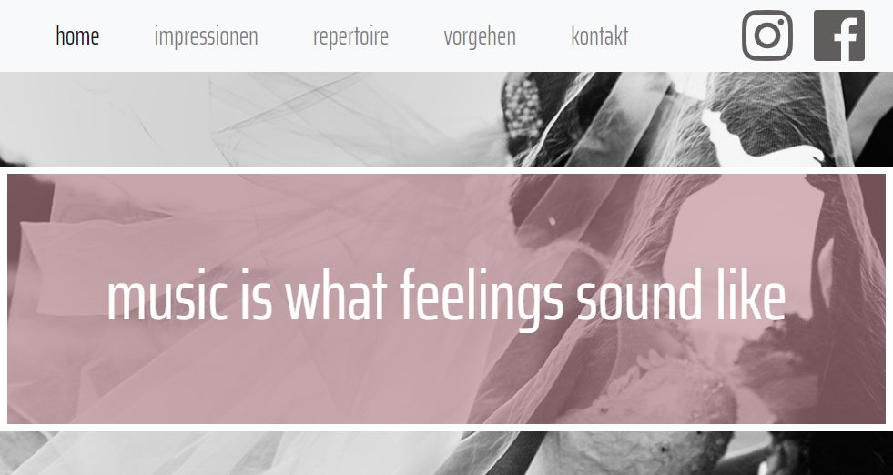
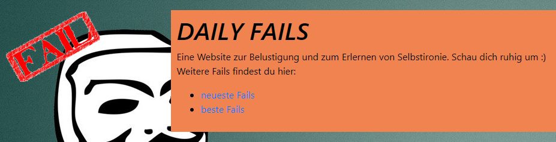

Im Freifach Web am [bwd Bern](https://www.bwdbern.ch) geht es einerseits darum, eine **Website zu designen und veröffentlichen** und andererseits Grundlagen zu schaffen für **eigene Projekt- und Businessideen**.

Alle Teilnehmer/innen wählen ein eigenes Web-Projekt und setzen dies entweder alleine oder in einem kleinen Team um. Hier ein Einblick in die Projekte, welche im Herbst/Winter 2018 entstanden sind:

### Müuchart - Galerie für Hobbyfotograf

Dario hat eine Website gestaltet für seinen Bruder, welcher Fotografiert aus Leidenschaft. Die Website hat über zehn Bildergalerien mit mehreren hundert Fotos!

[&rarr; Website: Müuchart](https://www.mueuchart.com/)

### Sing On Our Wedding

Irene hatte mit ihrer tollen Stimme schon etliche Auftritte an Hochzeiten. Mit dem neuen Webauftritt können sich Hochzeitspaare umfassend informieren und mit ihr Kontakt aufnehmen.

[&rarr; Website: Sing On Our Wedding](https://www.singonourwedding.ch/)

### Daily Fails

Eine Kursteilnehmerin zeigt, wie man auf lustige Art mit kleineren und grösseren Missgeschicken umgehen kann: Sie schreibt über ihre "Daily Fails" und lädt auch andere ein, ihre Fails zu veröffentlichen. 

[&rarr; Website: Daily Fails](https://daily-fails.netlify.com/fails/neueste/)

### Clubcompare

Gethushaan hat eine Vorlage geschaffen, um Clubs zu vergleichen - inklusive selbstgestaltetem Logo und Video im Hintergrund.

[&rarr; Website: Clubcompare](https://clubcompare.netlify.com)