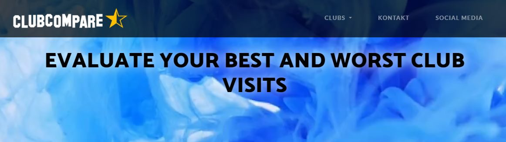

+++
title = "Einblick ins Freifach Web"
description = "Im Freifach Web am bwd Bern geht es natürlich um Webseiten, aber auch um eigene Projekt- und Businessideen. Hier ein kleiner Einblick."
date = 2019-02-20T00:00:00.000Z
image = "web.png"
+++

Im Freifach Web am [bwd Bern](https://www.bwdbern.ch) geht es einerseits darum, eine **Website zu designen und veröffentlichen** und andererseits Grundlagen zu schaffen für **eigene Projekt- und Businessideen**.

Alle Teilnehmer/innen wählen ein eigenes Web-Projekt und setzen dies entweder alleine oder in einem kleinen Team um. Hier ein Einblick in die Projekte, welche im Herbst/Winter 2018 entstanden sind:

### Müuchart - Galerie für Hobbyfotograf

Dario hat eine Website gestaltet für seinen Bruder, welcher Fotografiert aus Leidenschaft. Die Website hat über zehn Bildergalerien mit mehreren hundert Fotos!

<a href="https://www.mueuchart.com/" target="_blank">&rarr; Website: Müuchart</a>

### Sing On Our Wedding

Irene hatte mit ihrer tollen Stimme schon etliche Auftritte an Hochzeiten. Mit dem neuen Webauftritt können sich Hochzeitspaare umfassend informieren und mit ihr Kontakt aufnehmen.

<a href="https://www.singonourwedding.ch/" target="_blank">&rarr; Website: Sing On Our Wedding</a>

### Daily Fails

Eine Kursteilnehmerin zeigt, wie man auf lustige Art mit kleineren und grösseren Missgeschicken umgehen kann: Sie schreibt über ihre "Daily Fails" und lädt auch andere ein, ihre Fails zu veröffentlichen. 

<a href="https://daily-fails.netlify.com/fails/neueste/" target="_blank">&rarr; Website: Daily Fails</a>

### Clubcompare

Gethushaan hat eine Vorlage geschaffen, um Clubs zu vergleichen - inklusive selbstgestaltetem Logo und Video im Hintergrund.

<a href="https://clubcompare.netlify.com" target="_blank">&rarr; Website: Clubcompare</a>

### SV Events

Savio hat ein ganzes Corporate Design für eine Eventagentur erstellt. Seine Agentur ist noch nicht aktiv, könnte aber mit dieser Vorlage sofort beginnen, Events zu vermarkten. Das Logo ist auch eine Eigenentwicklung, enstanden in Zusammenarbeit mit einem Kollegen.

<a href="https://sv-events.netlify.com/" target="_blank">&rarr; Website: SV Events</a>

### Gilde Stratos Antarsias

Daniel hat für die Gilde "Stratos Antarsias" einen Webauftritt kreiert. Diese Website ist eine weitere Möglichkeit, wie sich Online-Spieler vernetzen können.

<a href="https://stratos-antarsias.netlify.com/" target="_blank">&rarr; Website: Stratos Antarsias</a>

### Vevey Museum

Jérôme hat für das Vevey-Traktorenmuseum einen Webauftritt kreiert.

<a href="https://veveymuseum.netlify.com/" target="_blank">&rarr; Website: Vevey Museum</a>