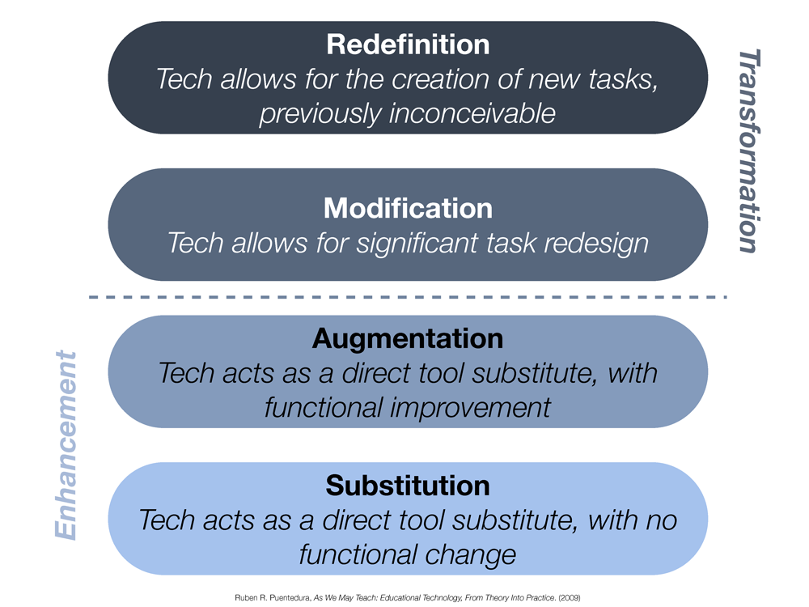

Ich mag es, wenn es etwas zu entdecken gibt, weil ich es noch nicht kenne. Von Digitalisierung haben wir aber schon so viel gehört, dass das Wort alleine wohl niemanden mehr vom Hocker reisst. Was nun dafür allen klar ist: Durch das Digital-Ding hat sich schon so einiges verändert und die Veränderung wird sich fortsetzen. Wohin genau die Reise geht, werden wir sehen, wenn wir dort sind. Aber darüber spekulieren, macht trotzdem Spass.

## Digitalisierung in der kaufmännischen Bildung

Ohne an dieser Stelle ins Detail zu gehen: Die kaufmännische Bildung ist besonders gefordert, sich neu zu finden in der digitalen Transformation. Es ist die grösste Berufsbildung der Schweiz und so wird unter dem Begriff ["Kaufleute 2022"](https://www.skkab.ch/de/kaufleute-2022) daran getüftelt, was es braucht, um diese Ausbildung fit zu machen für die Zukunft. Man liest vermehrt von Stichworten wie **kreatives Handeln, Kreieren digitaler Inhalte, Kollaboration, Projektführung, Veränderungsbereitschaft und das Erleben von Selbstwirksamkeit**.

## Legen wir los und zwar richtig

Irgendwie scheint es unpassend, von radikalen Umwälzungen zu sprechen, während wir uns Bildung in Zeiten der Digitalisierung höchstens vorstellen mit weniger Lehrbüchern und mehr Online-Material. Das tönt verdächtig nach dem papierlosen Büro, von dem wir vor 20 Jahren geträumt haben, um dann ein paar Jahre später zu merken, dass nur noch mehr Papier ver(sch)wendet wird.

Wenn es Phänomene gibt, gibt es meist jemand, der das in ein Modell packt. In diesem Fall ist es Dr. Ruben Puentedura, der mit dem [SAMR Modell](http://hippasus.com/rrpweblog/archives/2015/10/SAMR_ABriefIntro.pdf) verschiedene Stufen aufzeigt, wie neue Technologien unsere Lernprozesse verändern können.

Es ist ganz schwierig, aus unserer "Box" zu kriechen. Aber versuchen können wir es ja mal.

Man spricht von der "demokratisierung des Wissens".

## Eigene Website als ePortfolio

Die ganze Schule könnte anfangen, digitalen Content zu produzieren und zu veröffentlichen. Man könnte es auch «sharing by default» nennen, d.h. im Zweifel veröffentlichen und mit anderen Teilen.

Lernende zeigen, was sie alles lernen innerhalb wie auch AUSSERHALB der Schule.

### Warum?

* Wissen/Lernen sichtbar machen
* Learning out loud
* Dies wird zu ihrem Portfolio, welches sie auch als Bewerbung brauchen können.
* Self-Branding. Identität finden.
* Gegenseitige Inspiration
* Aufbau eines Portfolios (ganze Ausbildung könnte so festgehalten werden)
* Immer dabei è Alles wird konsequent digitalisiert
* Nebenbei lernen über digitale Technologien
* Öffentlichkeitswirksam (Build an audience)
  * Auch veröffentlichen, wenn etwas schief geht (own your bad news – someone is going to tell the story anyways).
* BIVO 2022: Digitale Inhalte kreiren, Kommunikation und Kollaboration, Kreatives Handeln
* Lebenslanges Lernen ==> Gilt auch für Lehrpersonen, Schulleitung
* Working Out Loud: https://www.janinekirchhof.com/eine-neue-lieblingsmethode-working-out-loud/
* Learning Out Loud
* Wichtigkeit, dass "Ownership" ganz bei Lernenden => Eigene Domain, Eigene Verwaltung und Verantwortung
* Motivation: Beurteilung?, Verbindlichkeit?, intrinsische Motivation?, Competition?, Social Pressure?, Fame?
* Gemeinsame Aggregations-Plattform
* Für Bewerbung

### Wie?

* Blogs, Vlogs, Podcasts
* Jeder eine eigene Website
* Technische Unterstützung
* Journalistische Unterstützung
* Da eine grosse Menge publiziert wird, müsste das Beste zusammengestellt und redaktionell aufbereitet werden (z.B. Featured this week)

## Stichworte

* Demokratisierung des Wissens
* Demokratisierung des Lernens / E-Portfolio (inkl. vorherige Blogeinträge):  http://blogfarm.medienbildung-unifl.de/lasses/2014/03/31/das-eportfolio-ein-fazit/
* Portfolios - ein Beitrag zur Demokratisierung des Lernens und der Leistungsbeurteilung: https://www.zora.uzh.ch/id/eprint/42852/
* ePortfolios Explained: https://uwaterloo.ca/centre-for-teaching-excellence/teaching-resources/teaching-tips/educational-technologies/all/eportfolios