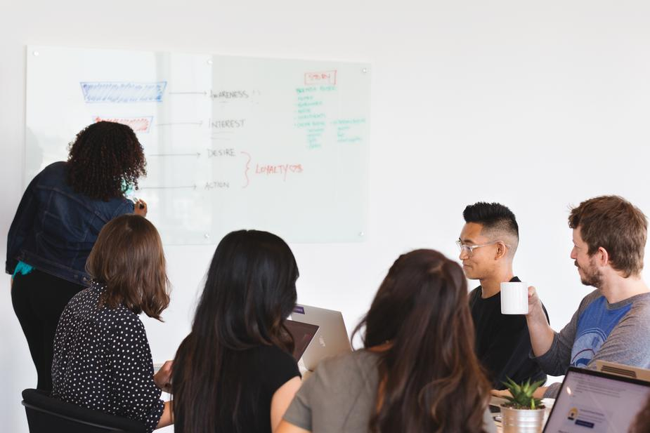

+++
title = "Projektstart \"Bring Your Own Device\""
description = "Dieser Blogeintrag zeigt auf, was die Idee des Projektes ist und wie wir uns als Projektteam organisieren."
date = 2019-01-17T00:00:00.000Z
image = "projektstart.jpg"
featured = true
+++

In diesem Jahr starten wir am [bwd Bern](https://www.bwdbern.ch/) mit einem **Projekt "Bring Your Own Device"**. Dieser Blogeintrag soll aufzeigen, was die Idee dieses Projektes ist und wie wir uns organisieren. Der Eintrag dient auch als Einladung für das erste Treffen der Projektgruppe und als Informationen für alle Interessierten.

Gleichzeitig beginnt eine neue Arbeitsgruppe **AG bwd digital**. Zusammen werden diese beiden Gruppen verschiedene Themen rund um die digitale Transformation bearbeiten.

## Warum das Ganze?

Das kaufmännische Berufsbild ist einer dauernden Entwicklung unterworfen. Der Einsatz digitaler Tools und Hilfsmittel für die Abwicklung von Aufträgen und für die Kollaboration in Unternehmen, Projekten und Teams gehört zum beruflichen Alltag der angehenden Kaufleute.

Der Arbeitsmarkt verändert sich. Zukünftig stärker geforderte **Kompetenzen** sind mitunter:

- Informations- und Datenanalyse
- Kommunikation und Kollaboration
- Kritisches Denken
- Kreatives Handeln
- Digitale Inhalte kreieren
- Datensicherheit
- Problemlösestrategien
- Prozessuales Denken
- Projekte führen/begleiten
- Veränderungsbereitschaft / Selbstwirksamkeit

Die [Bildungsverordnung 2022 für Kaufleute](https://www.skkab.ch/de/kaufleute-2022) soll dem Rechnung tragen.

## Projekt "Bring Your Own Device" (BYOD)

Die [Direktion des bwd](https://www.bwdbern.ch/bwd/ueber-uns/direktion-bwd/) hat das _Projekt BYOD_ initiiert und mir einen Auftrag vergeben für die Projektleitung. Aus den oben aufgeführten Kompetenzen wurde für das _Projekt BYOD_ folgende Zielsetzungen abgeleitet:

  

    <h5 class="card-title">Zielsetzungen Projekt BYOD</h5>
    <ul class="card-text">
      <li class="small">Die Einführung von BYOD entspricht dem durch die digitale Transformation ausgelösten Wandel des kaufmännischen Ausbildungsprofils.</li>
      <li class="small">Die Befähigung der Lehrkräfte zum didaktisch-methodisch zielführenden Einsatz von BYOD hat im Projekt eine hohe Priorität.</li>
      <li class="small">Methodik und Didaktik im Fachunterricht beziehen die Verfügbarkeit des Device mit ein, wenn dies einen Mehrwert auslöst und sinnvoll ist.</li>
      <li class="small">BYOD ist ein Beitrag zur Kompetenzorientierung und ermöglicht erweiterte Formen des Wissenserwerbs («Flipped classroom»), des selbständigen Lernens und der Reflexion (E-Portfolio).</li>
      <li class="small">BYOD ist in erster Linie ein pädagogisch-didaktisches Projekt; die Technik ist Hilfsmittel.</li>
      <li class="small">Die Verfügbarkeit des eigenen Device im Unterricht (Notebook) ermöglicht und fördert digitale Formen der Kollaboration.</li>
    </ul>
  

## Organisation

Die _Projektgruppe BYOD_ besteht aus 7 Mitgliedern der Grundbildung am bwd. Da es von den Themen her viel Überschneidung gibt mit der _AG bwd digital_, haben wir uns entschieden, dass jeweils die Leitung der einen Gruppe in der anderen Gruppe vertreten sein wird. Damit können wir uns bei Bedarf jeweils kurz absprechen, ob ein Thema oder eine Aufgabe besser in der einen oder anderen Gruppe bearbeitet werden soll.

Personell ergibt sich aktuell folgende Zusammenstellung:

### Fällen von Entscheidungen

Wir werden uns nicht allzu oft als ganze Gruppen treffen können. Das heisst, wir brauchen eine effiziente und klare Form, Entscheidungen zu fällen.

Es ist wichtig, dass wir den Entscheidungsprozess definieren. Was sonst oft passiert in solchen Gruppen, ist, dass man entweder davon ausgeht, dass alle im Konsens einverstanden sein müssen oder es spielen unklare Hierarchien. Konsens kann zu sehr lange Diskussionen führen. Und wenn es nicht Konsens ist, dann wäre z.B. bei der Gruppe _BYOD_ unklar, wie viel ich jetzt als Leitung alleine entscheiden könnte und wie viel andere Gruppenmitglieder (welche ja auch unterschiedliche Positionen in der Schule vertreten).

Marco G. (Leiter AG bwd digital) und ich haben uns dazu unterhalten. Wir möchten es gerne so handhaben, dass **alle Mitglieder das gleiche Recht haben, Entscheidungen zu fällen für die Gruppe**. Um dies zu ermöglichen, nutzen wir eine neue Formen der Entscheidungsfindung:

### Soziokratische Entscheidungen

Entscheide in der _Projektgruppe BYOD_ und der _AG bwd digital_ fällen wir nicht nach Konsens oder durch einen demokratischen Mehrheitsentscheid, sondern nach **soziokratischem Konsent** (beachte: Konsen&#8209;**t**, nicht Konsen&#8209;**s**).

Beim _soziokratischen Konsent_ stellt man nicht die Frage, wer mit einem Vorschlag "einverstanden" ist, sondern ob jemand einen **"schwerwiegenden Einwand"** hat gegen den Vorschlag. Alle Gruppenmitglieder werden der Reihe nach gefragt, ob sie einen schwerwiegenden Einwand vorbringen möchten. Falls niemand einen Einwand hat, wird der Vorschlag angenommen.

Diese Entscheidungsform hat ein paar entscheidende Vorteile als Gruppe:

- Vorschläge kommen schneller durch, weil man nicht eine Lösung finden muss, die allen passt, sondern eine Lösung, "mit der alle leben können".
- Es entsteht eine Kultur der Innovation. Es wird nicht gewartet auf die perfekte Lösung, die dann nie kommt. Man spricht auch von einem ["good enough for now and safe enough to try"](https://medium.com/@almerudcaspian/good-enough-for-now-safe-enough-to-try-9dec91f0af07). 
- Jede Person wird angehört und ernst genommen. Mit einem "schwerwiegenden Einwand" haben alle eine Art Veto-Recht und können den Vorschlag stoppen, wenn sie denken, dass es die Gruppe in Schwierigkeiten bringen könnte.

### Beispiel für einen Entscheid

Ich werde beim ersten Meeting den Vorschlag einbringen, dass wir die Ergebnisse unserer Meetings jeweils als Blogeinträge aufbereiten, wie diesen Eintrag hier (natürlich mit dem nötigen Respekt und Schutz der Personen). Der Sinn ist, dass sich alle informieren können - auch die, welche nicht in der Projektgruppe sind.

So läuft der soziokratische Entscheid ab: Zuerst kann der Reihe nach jede/r Klärungsfragen stellen zu diesem Vorschlag. In der zweiten Runde kann jede/r eine Reaktion darauf äussern (z.B. "bin begeistert" oder "habe ein etwas mulmiges Gefühl"). In der dritten Runde werden alle gefragt, ob sie "einen schwerwiegenden Einwand" haben. Hat niemand einen Einwand, gilt der Vorschlag als angenommen. Ein Einwand von einer Person reicht, um den Vorschlag zu kippen. Meist wird dann der Entscheid auf das nächste Meeting vertagt, damit ein verbesserter Vorschlag gefunden werden kann.

Das scheint auf den ersten Blick aufwändig zu sein. Die Runden gehen aber sehr schnell. Denn es wird zwar Feedback aufgenommen, aber es finden keine Diskussionen statt während dem Meeting.

---

Weitere Details zum Ablauf eines soziokratischen Konsents sind im Blogeintrag [Entscheidungsprozess](/entscheidungsprozess/) zu finden.

---

## Erstes Meeting der Projektgruppe BYOD

Als *Projektteam BYOD* treffen wir uns zum ersten mal am *Freitag, 25. Januar 2019, 16.00-17.30 Uhr*.

Wir können schon im ersten Meeting als Gruppe nach soziokratischem Konsent Entscheide fällen. Wir könnten auch entscheiden, dass wir diese Entscheidungsform wieder abschaffen wollen ;-).

In diesem ersten Meeting wird es um folgende Themen gehen:

- Ziele von BYOD am bwd
- Organisation und Entscheidungsfindung
- Grundprinzip: "Zuerst digitale Anwendungen finden, die Begeisterung auslösen. Dann dazu passende Infastruktur (z.B. BYOD) organisieren."
- Digitale Kommunikation der Gruppe und Transparenz
- Ideen aus der Gruppe, denen wir nachgehen möchten
  - [Idee: Persönlicher Lernblog](/lernblog-idee/) **(bitte als Vorbereitung lesen!)**
  - Pädagogisch-didaktische Möglichkeiten
  - Austausch über weitere Ideen
- Nächste Treffen
  - Zeitressourcen (Mandat von Marco J. von ca. 200 Stunden im Jahr 2019, Verfügbarkeit anderer Teammitglieder)
  - Vorschlag: Alternierend einmal Video-Konferenz, einmal vor Ort
- Nächste Schritte
- Varia

Ja, es ist recht viel für das knappe Zeitfenster. Ich werde trotzdem versuchen, es so zu moderieren, dass es Raum gibt, sich **gegenseitig zu informieren und inspirieren**, **Feedback einzuholen** und allfällige **soziokratische Entscheide** zu fällen. Das erste Treffen ist sicher speziell. Mit der Zeit werden wir eine passende Form finden für unsere Meetings, kombiniert mit informellen Treffen im Schulhaus und digitalem Informationsaustausch.

## Weiterentwicklung

Ich bin persönlich überzeugt, dass **Lernen auf jeder Ebene einer Organisation** stattfinden sollte. Und das gilt natürlich in besonderem Mass für uns als Schule, einer "Institution des Lernens". Das heisst, auch die _Projektgruppe BYOD_ und die _AG bwd digital_ werden wir möglichst "agil" halten, damit wir aus dem Prozess lernen und uns weiterentwickeln können.

Wie sich unsere Zusammenarbeit bewährt und weiterentwickelt, wäre sicher interessanter Stoff für spätere Blogeinträge... Ich hoffe jedenfalls, dass ich genug Zeit finde, diesen Blog zu füttern. Und vielleicht braucht es auch etwas Mut, Blogeinträge raus zu lassen, die "good enough for now and safe enough to try" sind. Das fällt mir noch nicht so leicht.

---

<small><em>Bildquellen: Tisch mit Laptops von [StartupStockPhotos](https://pixabay.com/de/start-start-up-notizb%C3%BCcher-kreative-593296/) (free license), Meeting von [Sarah Pflug](https://burst.shopify.com/photos/business-meeting-with-large-team) (free license)</em></small>